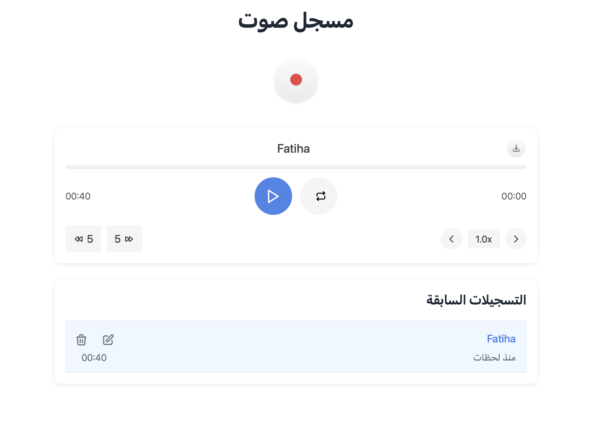

# Audio Recorder Application

A modern, responsive audio recorder built with Svelte and TypeScript. This application allows you to record, play, manage, and download audio recordings directly in your browser, with a clean interface and robust features.



## Features

- **Simple Recording Interface**
  - One-click recording with clear visual feedback
  - Recording timer display
  - Automatic saving to browser storage

- **Advanced Playback**
  - Variable playback speed (0.5x to 2.0x)
  - 5-second skip forward/backward controls
  - Interactive progress bar for seeking
  - Repeat/loop functionality
  - Visual feedback during playback

- **Recording Management**
  - Persistent storage using IndexedDB
  - Rename recordings
  - Delete with confirmation
  - Download as MP4 files
  - Time-ago display (e.g., "2 hours ago")

- **Responsive & Accessible Design**
  - Mobile-friendly layout that adapts to screen size
  - RTL language support with full Arabic localization
  - Keyboard navigation support
  - Proper ARIA attributes for screen readers

## Technical Implementation

The application is built with:

- **Svelte 5** for reactive UI components
- **TypeScript** for improved type safety
- **IndexedDB** (via idb-keyval) for client-side storage
- **Web Audio API** for recording and playback
- **Vanilla CSS** for styling (no external frameworks)

## Project Organization

The project follows a clean, modular architecture:

```
src/
├── components/         # UI Components
│   ├── AudioPlayer.svelte
│   ├── RecordButtons.svelte
│   ├── RecordingsList.svelte
│   └── ui/             # Reusable UI elements
├── lib/
│   ├── services/       # Core business logic
│   ├── stores/         # Svelte stores for state management
│   ├── types/          # TypeScript type definitions
│   └── utils/          # Helper functions
└── App.svelte          # Main application entry point
```

## Development

### Prerequisites

- Node.js (v18+)
- pnpm

### Setup

1. Clone the repository:
   ```bash
   git clone https://github.com/nuqayah/recorder.git
   cd recorder
   ```

2. Install dependencies:
   ```bash
   pnpm install
   ```

3. Start the development server:
   ```bash
   pnpm dev
   ```

4. Open your browser to the URL shown in the terminal (typically http://localhost:5000)
